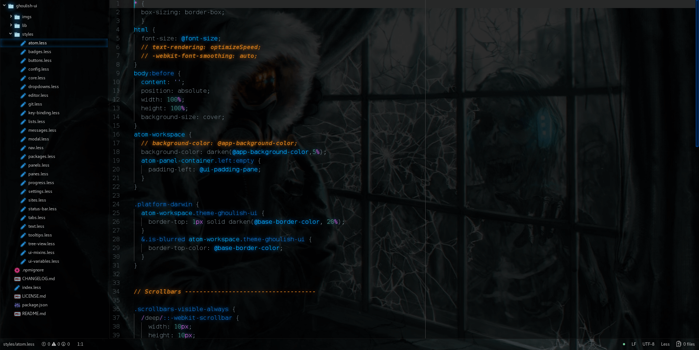
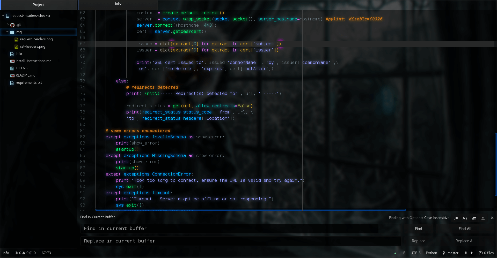

# Ghoulish UI

***Colorful, dark and bold UI theme for Atom code editor***

## Features

* Customizable tree view gradient
* File type icons (PHP, Python, Ruby, Sass, etc.)
* Glowing tab highlight with active page glow, to differentiate windows
* Glowing selection on tree view
* Translucent backgrounds that adapt to the color scheme of the syntax theme
* Customizable background image
* Highlighted git branch
* Customizable font size

## Compatible syntax themes

- All dark themes
- Looks best with [Volcanic Dark Syntax](https://atom.io/themes/volcanic-dark-syntax),
[Steam Pirate Syntax](https://atom.io/themes/steam-pirate-syntax), [Neon-Syntax](https://github.com/anomaly256/neon-syntax) or default one-dark-syntax  

## Install
The easiest way to install Ghoulish is to do so from the Atom UI:

  - Go to Atom > Settings
  -  Click "+ Install"
  - Search for **ghoulish ui** and click themes button to search.
  - Browse for Ghoulish UI and click install

Alternatively, you can use the Atom Package Manager:
```bash
apm install ghoulish-ui
```





### If you want to disable file type icons
In `index.less` change:
```less
.icons(true);
```
to:
```less
.icons(false);
```

### Credits
* Forked from [Steam Pirate UI](https://github.com/v3ss0n/steam-pirate-ui) with [dallinb](https://github.com/dallinb) deprecation fixes; which was originally based on [one-dark-ui 0.9.0](https://github.com/atom/one-dark-ui/) and inspired by [Neon Syntax](https://github.com/anomaly256/neon-syntax)
* File type icons forked from [Seti Classic](https://github.com/vermotr/seti-classic)
* Default wallpaper by [alexiuss](https://alexiuss.deviantart.com/art/HAVE-YOU-CONSIDERED-WORKING-IN-YOUR-SLEEP-376953994)
